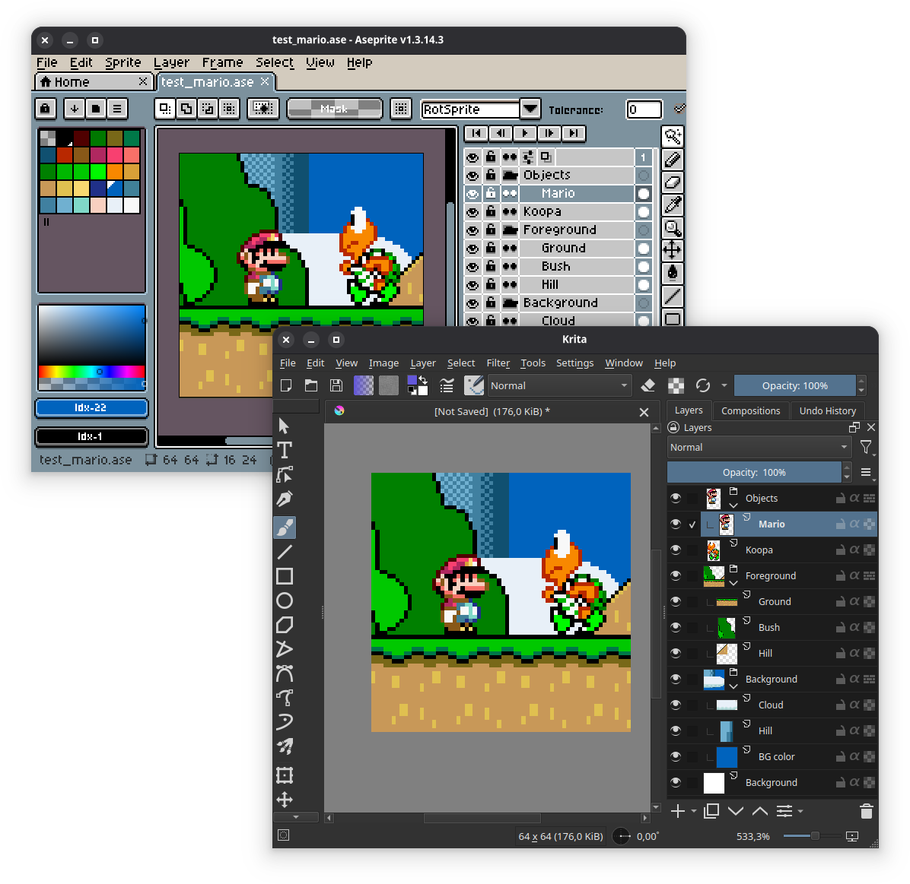

# Krita Aseprite file plugin

Plugin for loading aseprite files in Krita.

## Installation

To install this plugin, simply copy (or make a symbolic link of) both the `krita_aseprite.desktop` file and `krita_aseprite/` folder to the `pykrita/` folder in your resource folder (`Settings -> Manage Resources -> Open Resource Folder`)

Then simply enable the plugin in the Python Plugin Manager (`Settings -> Configure Krita -> Python Plugin Manager`)

## Usage

Open aseprite file: `Tools -> Scripts -> Open Aseprite file...`

## What works

This plugin is currently very wip!!

So far there is support for loading Aseprite files into a new document with all cels from the first frame.

Some examples of things not yet implemented:
- Saving _to_ `.aseprite` / `.ase`
- Files with more than one frame (such files still load, but only the cels in the first frame will be added to the document)
- Anything involving tiles / tilesets
- User data
- etc...
